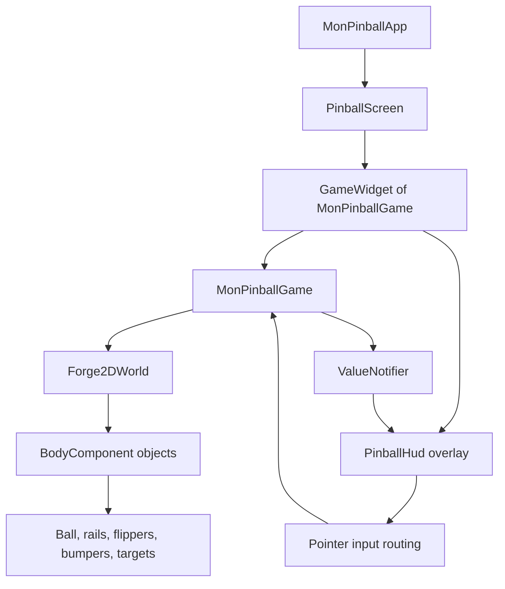
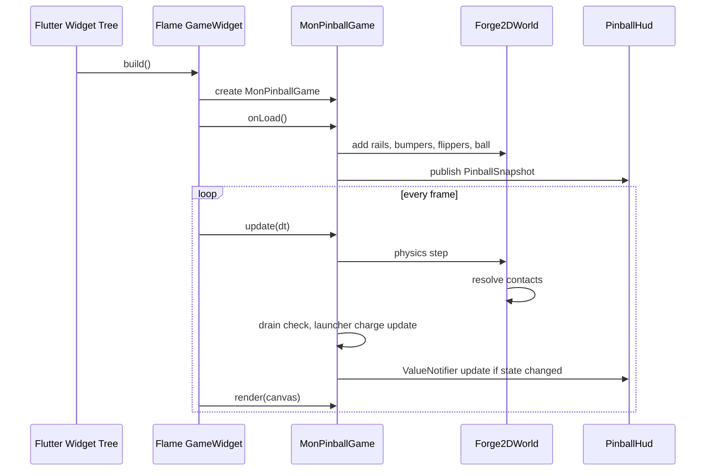
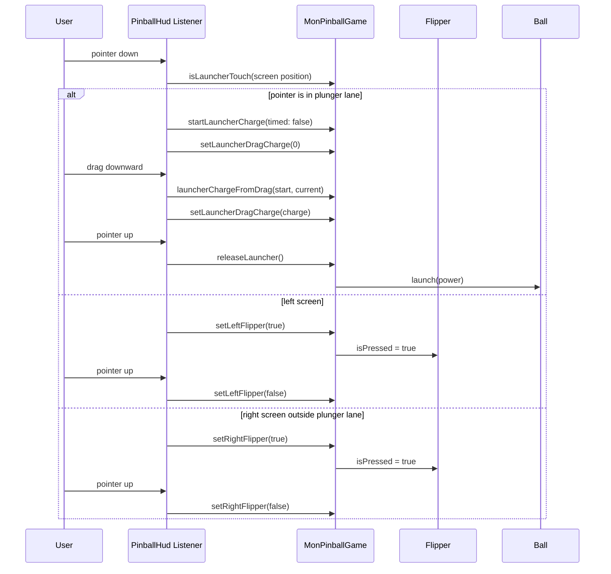
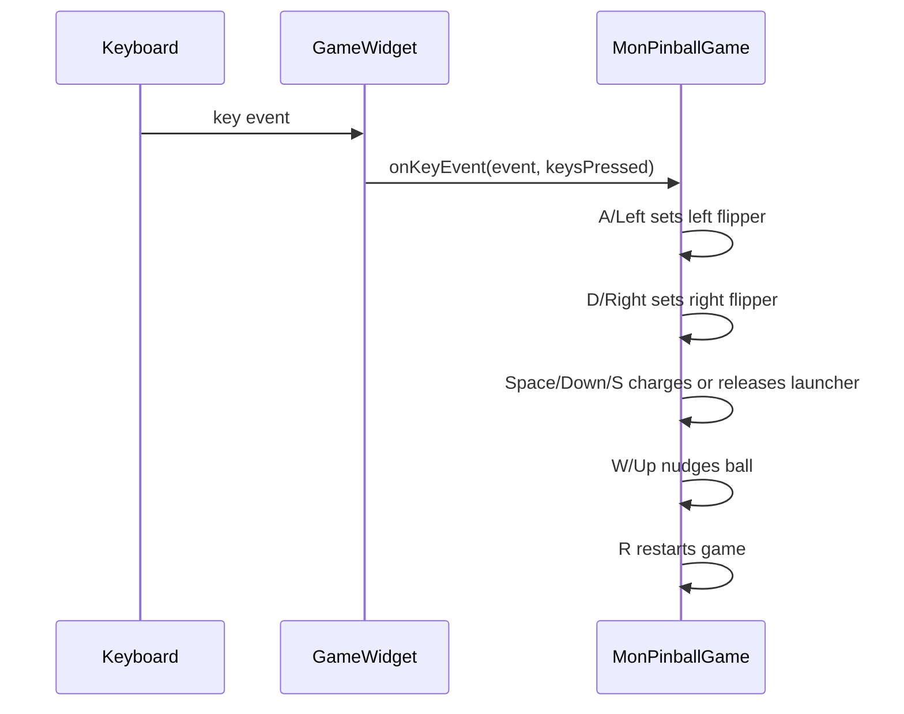
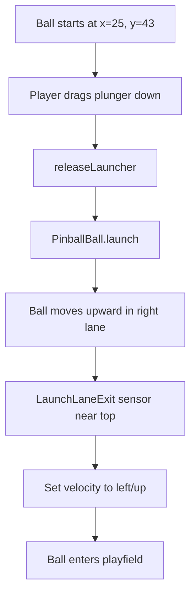
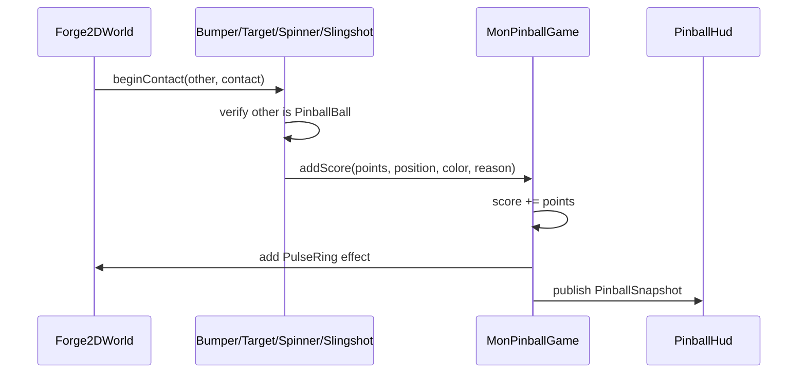
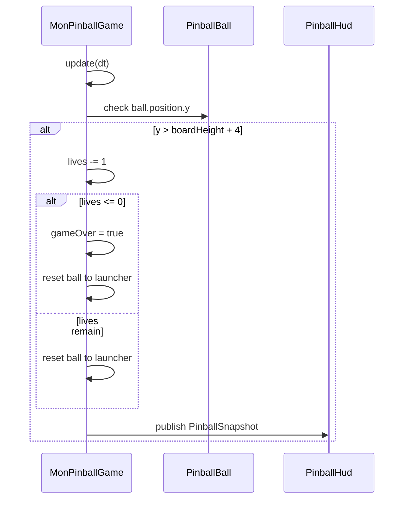

# Mon Pinball

Flutter + Flame + Forge2D로 만든 작은 핀볼 게임입니다. Flutter 위젯은 앱 셸과 HUD/입력을 담당하고, Flame/Forge2D는 게임 루프와 물리 월드를 담당합니다.

## Run

```sh
flutter pub get
flutter run
```

## Controls

- Touch left side: left flipper
- Touch right side outside the plunger lane: right flipper
- Drag the right plunger lane downward, then release to shoot
- Keyboard: `A`/left arrow, `D`/right arrow, `Space`/down arrow to launch, `W`/up arrow to nudge, `R` to restart

## Checks

```sh
flutter analyze
flutter test
flutter build apk --debug
```

## Project Structure

```text
lib/
  main.dart          Flutter app, GameWidget host, HUD overlay, touch input routing
  pinball_game.dart  Flame/Forge2D game, physics bodies, scoring, rendering

test/
  widget_test.dart   Smoke test for app/HUD rendering
```

## Architecture

Android 개발자 관점으로 보면 `main.dart`는 Activity/Fragment + overlay UI에 가깝고, `pinball_game.dart`는 custom game view + physics engine에 가깝습니다.



### Layer Responsibilities

| Layer | File | Responsibility |
| --- | --- | --- |
| App shell | `lib/main.dart` | `MaterialApp`, screen setup, `GameWidget` mounting |
| HUD overlay | `lib/main.dart` | Score/lives/status/launcher charge UI |
| Touch input | `lib/main.dart` | Pointer down/move/up events, launcher drag tracking, flipper press state |
| Game state | `lib/pinball_game.dart` | Score, lives, launcher charge, game over, HUD snapshots |
| Physics world | `lib/pinball_game.dart` | Forge2D gravity, bodies, fixtures, collision callbacks |
| Rendered table | `lib/pinball_game.dart` | Board background, rails, bumpers, slingshots, ball, effects |

## Runtime Flow

Flame이 매 frame마다 `update(dt)`와 `render(canvas)`를 호출합니다. Android의 `Choreographer` + custom `View.onDraw()`를 game framework가 대신 관리한다고 보면 됩니다.



## Main Classes

### `MonPinballGame`

`MonPinballGame` extends `Forge2DGame` and is the central game controller.

Responsibilities:

- Creates the fixed-size board world: `28 x 48`
- Owns score, lives, launcher charge, status, game-over state
- Publishes HUD data through `ValueNotifier<PinballSnapshot>`
- Handles keyboard input through Flame `KeyboardEvents`
- Builds rails, bumpers, targets, flippers, launcher, ball
- Detects drain when the ball falls below the table

Important methods:

| Method | Purpose |
| --- | --- |
| `onLoad()` | Initial world setup and component creation |
| `onGameResize()` | Fits the fixed world into the current screen |
| `update(dt)` | Per-frame launcher charge and drain detection |
| `isLauncherTouch()` | Converts screen coordinate to world coordinate and checks plunger zone |
| `launcherChargeFromDrag()` | Converts downward drag distance into charge `0.0..1.0` |
| `releaseLauncher()` | Applies launch velocity to the ball |
| `addScore()` | Updates score and spawns a pulse effect |
| `restartGame()` | Resets score/lives/ball/launcher state |

### `PinballHud`

`PinballHud` is a Flutter overlay on top of the Flame canvas. It uses `ValueListenableBuilder` to redraw when `MonPinballGame.hud` changes.

It also routes touch input:

- Left half: left flipper
- Right half outside plunger lane: right flipper
- Right plunger lane: drag launcher

The important design choice is that pointer input is handled in Flutter overlay code, but game intent is delegated into `MonPinballGame`. This keeps UI concerns out of the physics classes.

### Physics Components

Most table objects extend `BodyComponent<MonPinballGame>`. `BodyComponent` is the Flame/Forge2D bridge: it owns a Forge2D `Body`, renders it, and receives updates in the Flame component tree.

| Class | Body Type | Purpose |
| --- | --- | --- |
| `PinballBall` | dynamic | Main ball affected by gravity, impulse, collisions |
| `TableRail` | static edge | Table boundaries and lane rails |
| `Flipper` | kinematic | Player-controlled rotating flipper body |
| `Bumper` | static circle | Scores points and pushes the ball away |
| `Spinner` | static polygon | Scores points and renders spin feedback |
| `DropTarget` | static polygon | Scores target hits |
| `Slingshot` | static polygon | Triangle rebound zones near flippers |
| `LaunchLaneExit` | static sensor | Nudges launched ball from plunger lane into the playfield |
| `LauncherView` | visual only | Draws plunger track and charge position |
| `PulseRing` | visual only | Temporary score hit effect |

## Input Flow

### Touch: Flippers And Launcher



### Keyboard



## Launcher Algorithm

Mobile launcher behavior intentionally uses drag distance instead of tap duration. This makes the control feel like pulling an actual spring.

```text
onPointerDown(position):
  if position is inside launcher lane:
    remember drag start position
    set charge to 0
    mark action as launcher
  else if x is left half:
    press left flipper
  else:
    press right flipper

onPointerMove(position):
  if current action is launcher:
    startWorld = screenToWorld(dragStart)
    currentWorld = screenToWorld(position)
    charge = clamp((currentWorld.y - startWorld.y) / 6.2, 0, 1)
    update HUD charge
    update LauncherView.charge

onPointerUp:
  if current action is launcher:
    power = max(charge, 0.2)
    ball.velocity = Vector2(0, -35 - 48 * power)
    reset charge to 0
```

Why `currentWorld.y - startWorld.y`:

- In this board coordinate system, larger `y` means lower on the table.
- Pulling the finger downward increases `y`.
- That maps naturally to stronger spring tension.

## Ball Launch And Lane Exit

The launcher lane is on the right side. The ball starts near the bottom of that lane. When launched, it travels upward. The top lane is intentionally widened, and `LaunchLaneExit` acts as a sensor to push the ball left into the playfield.



The sensor does not physically block the ball because its fixture is `isSensor: true`. It detects contact and rewrites the ball velocity once, with a cooldown to avoid repeated impulses.

## Collision And Scoring

Forge2D contact callbacks are delivered through `ContactCallbacks`. Score objects mix in `ContactCallbacks` and implement `beginContact`.



Scoring safeguards:

- Bumpers, spinners, and targets use short cooldowns to prevent score spam from a single contact cluster.
- `gameOver` prevents new score updates.
- Hit effects are separate `PulseRing` components so scoring does not depend on UI overlay rendering.

## Flipper Algorithm

The flippers are Forge2D kinematic bodies. They do not use a revolute joint yet. Instead, they rotate toward a target angle by setting angular velocity.

```text
update(dt):
  targetAngle = isPressed ? activeAngle : restAngle
  delta = targetAngle - currentAngle

  if abs(delta) is small:
    angularVelocity = 0
    snap transform to targetAngle if world is not locked
  else:
    angularVelocity = clamp(delta * 24, -24, 24)
```

Tradeoff:

- This is simpler and stable enough for the first version.
- A more realistic version can replace it with Forge2D `RevoluteJoint` and motor limits.

## Drain And Reset Flow



## Coordinate System

The game uses a fixed world size and adapts camera zoom to screen size.

```text
World size: 28 x 48
Origin: top-left-ish table coordinate space
x increases to the right
y increases downward
Camera: centered at board center
Zoom: min(screenWidth / 28, screenHeight / 48) * 0.96
```

This means physics tuning is independent of phone resolution. The Flutter pointer position is converted back into world coordinates when checking the launcher lane.

## Current Limitations

- Flippers are kinematic angle-driven bodies, not joint-driven motors.
- There is no sound yet.
- There are no image assets. Everything is drawn with Canvas primitives.
- Table layout is hardcoded in world coordinates.
- Only a smoke widget test exists. Physics behavior is currently verified manually.

## Good Next Refactors

1. Split `pinball_game.dart` into `components/`, `input/`, and `state/` folders once the table grows.
2. Replace flippers with `RevoluteJoint` + motor limits for more realistic physical response.
3. Add sound effects through `flame_audio`.
4. Add deterministic component tests around launcher charge and drain/reset logic.
5. Extract table coordinates into a data object so levels can be tuned without editing component code.

## Initial Commit Checklist

```sh
flutter analyze
flutter test
git init
git add .
git commit -m "Initial Flame pinball game"
```
